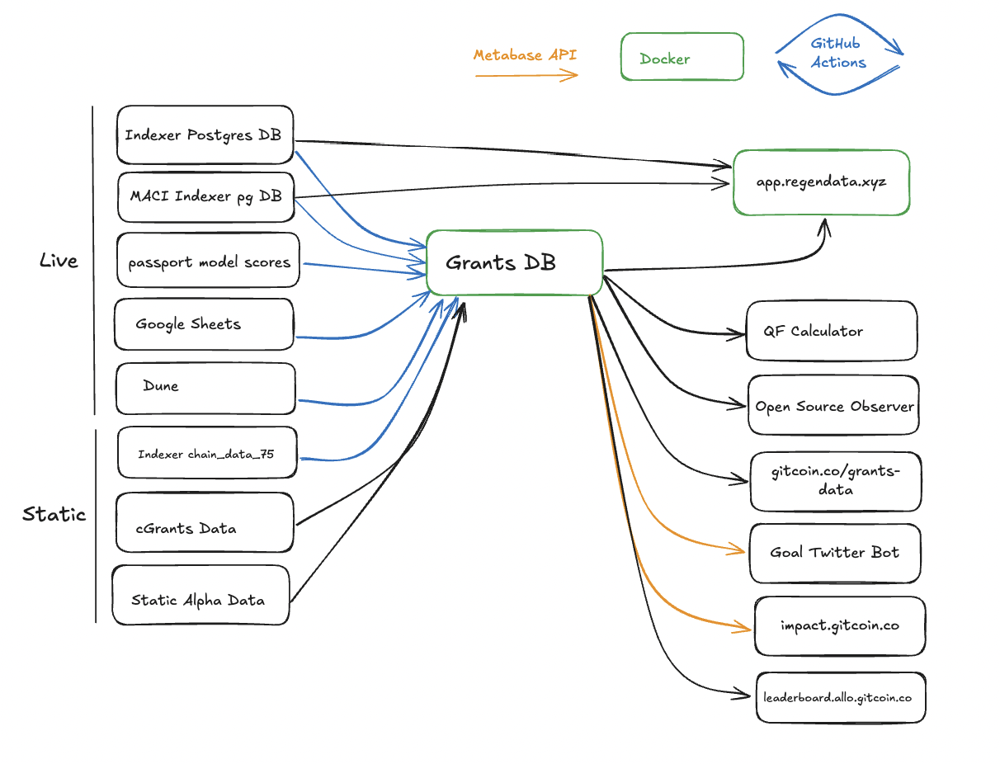

# Architecture
Digital Ocean hosts our regendata infrastructure, including a droplet named `grants-etl`, which runs our dockerized Postgres DB and the Metabaser server for app.regendata.xyz.

**Level 1: Architecture Overview**

- **Digital Ocean**:
    - **Droplet: `grants-etl`**: Hosts our dockerized Postgres DB and the Metabaser server for app.regendata.xyz.
    - **Spaces**: An S3 bucket where the passport team uploads data, containing two key files:
        - **`registry_score.jsonl`**: Passport stamps data.
        - **`model_scores.parquet`**: Passport model scores data.
- **Vercel Page**: Handles Metabase signups, with the repository located at https://github.com/supermodularxyz/regendata.xyz. 
- **Postmark**: Handles email notifications for Metabase signups.
- **Github Actions**: Orchestrates the ETL process from the regendata repo.
- **Live Data Sources**:
    - **Grants Stack Indexer Postgres DB**: we use a foreign data wrapper to connect to this and update Grants DB every 4 hours. Unions with Indexer Chain Data 75.
    - **MACI Indexer Postgres DB**: we use a foreign data wrapper to connect to this and update Grants DB every 4 hours
    - **Dune**: we upload query results to the DB every 4 hours
    - **Passport Model Scores**: we load the parquet file into the DB once a day
    - **Google Sheets**: we upload sheets to the DB once a day
- **Static Data Sources**:
    - **Indexer Chain Data 75**: a static copy of indexer data we union with live data when importing into the DB. This is because the indexer data does not support the full chain history, notably PGN. 
    - **cGrants Data**: a static copy of cGrants data (Rounds 1 to 15)
    - **Alpha Round Data**: a static copy of alpha round data (Round 16)
- **Outbound Data**: The Grants DB is used for the following:
    - **Regen Data Metabase**: The Grants DB is used for the Regen Data Metabase, which is used to track and analyze data
    - **QF Calculator**: The Grants DB is used for the QF Calculator, which is used to calculate matching funds for grants
    - **Open Source Observor**: The Grants DB data is imported by Open Source Observor, which is used to track and analyze open source projects
    - **gitcoin.co/grants-data**: The Grants DB is used for the gitcoin.co/grants-data dashboard, which is used to track and analyze grants data
    - **GTC Goal Tracker Twitter Bot**: The Grants DB is used to track our progress toward our GMV goal and tweeted out once a day. This uses the Metabase API to get the data and pulls specifically from this card: 
    - **Impact.gitcoin.co**: This page displays live gitcoin stats using the Metabase API and pulls specifically from this card: 
    - **leaderboard.allo.gitcoin.co**: This page displays the GMV leaderboard for the Allo protocol, aggregating data across donors, grantees, round operators, and contract developers. 

