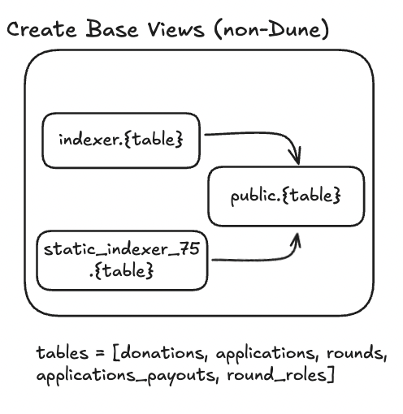
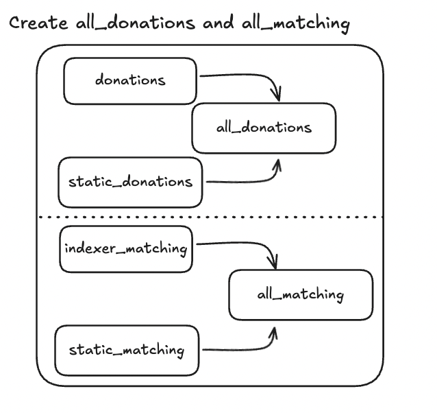

# Overview of `update_materialized_views.py`

The `update_materialized_views.py` script is designed to refresh materialized views in our PostgreSQL database. This process ensures that the views are up-to-date with the latest data, prevents running analytics queries against our production postgres db, and uses indexes to optimize query performance.

## Key Components

### Configuration and Setup
- **Environment Variables:** The script uses environment variables for database connection parameters and the Dune API key.
- **Logging:** Configured to log information and errors for debugging and monitoring.
- **Foreign Data Wrappers:** These are used to connect to the Indexer and MACI databases. They are created by the `create_foreign_data_users.py` script.

### Materialized Views
- **Existing Views:** These are not created by this script but are used by it.
  - **static_donations:** Defined in `static_donations.sql`, this view is created using static data from cGrants (an old Gitcoin DB in AWS) and Alpha Rounds (retrieved from etherscan).
  - **static_matching:** Defined in `static_matching.sql`, this view is similarly created using static data.

- **Base Materialized Views:** Defined in `BASE_MATVIEWS`, these are the primary views that are refreshed. Most of them depend on connections to the `indexer` and `static_indexer_chain_data_75` databases.
  - **applications:** Depends on `indexer.applications` and `static_indexer_chain_data_75.applications`.
  - **rounds:** Depends on `indexer.rounds` and `static_indexer_chain_data_75.rounds`.
  - **donations:** Depends on `indexer.donations` and `static_indexer_chain_data_75.donations`.
  - **applications_payouts:** Depends on `indexer.applications_payouts` and `static_indexer_chain_data_75.applications_payouts`.
  - **round_roles:** Depends on `indexer.round_roles`.
  - **allov2_distribution_events_for_leaderboard:** This base view is special because it is imported from a Dune query. 

- **Dependent Materialized Views:** Defined in `DEPENDENT_MATVIEWS`, these rely on the base views and are created after them.
  - **indexer_matching:** Depends on `applications`, `rounds`, and `donations`.
  - **all_donations:** Depends on `donations` and `static_donations`
  - **all_matching:** Depends on `indexer_matching` and `static_matching`.
  - **allo_gmv_leaderboard_events:** Depends on `donations`, `rounds`, `applications`, `applications_payouts`, and `allov2_distribution_events_for_leaderboard`.

## Main Process

1. **Record Totals:** Records current totals of base views for validation.
2. **Create Base Views:** Creates new base materialized views.
3. **Create Dependent Views:** Creates new dependent materialized views.
4. **Atomic Swap:** Swaps old views with new ones to ensure consistency.
5. **Validation:** Validates the refresh by comparing totals.
6. **Cleanup Old Views:** Removes old views after successful refresh.

## Atomic Swap

The script employs an atomic swap to ensure a consistent and all-or-nothing update of materialized views. This approach prevents data outages by rolling back the entire process if any part of the refresh fails.

To achieve this, the script:

1. Creates new views with a `_new` suffix.
2. Ensures dependent views reference the `_new` views.
3. Simultaneously swaps all `_new` views with their corresponding old views.

This simultaneous swap is crucial to prevent dependent views from referencing old views during the swap process.

## Refreshing Dependent Views

Dependent views are refreshed by reading SQL queries from files specified in `DEPENDENT_MATVIEWS`. The script manipulates these queries to account for the `_new` suffix used during the refresh process:

- **SQL File Manipulation:** 
  - The script reads the SQL query from the specified file.
  - It replaces references to base views with their `_new` counterparts to ensure the query uses the latest data.
  - For specific views like `allo_gmv_leaderboard_events`, additional logic is applied to insert table mappings directly into the query.

